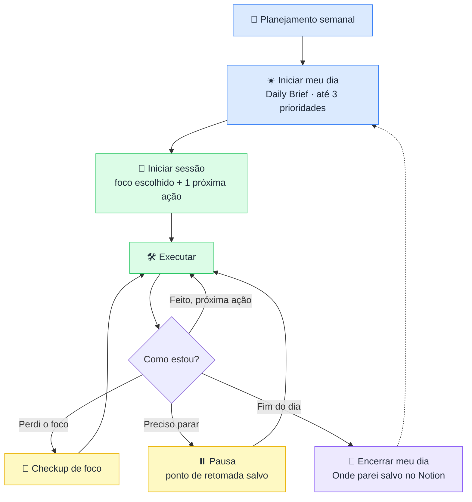
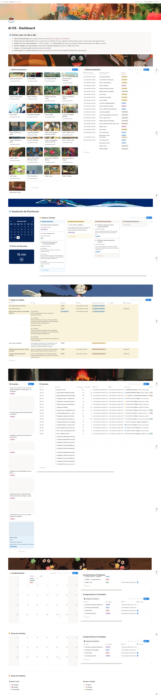
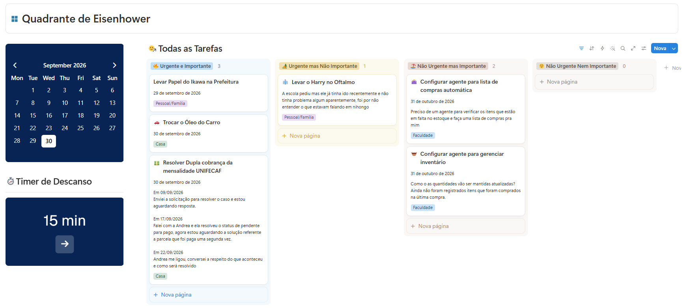
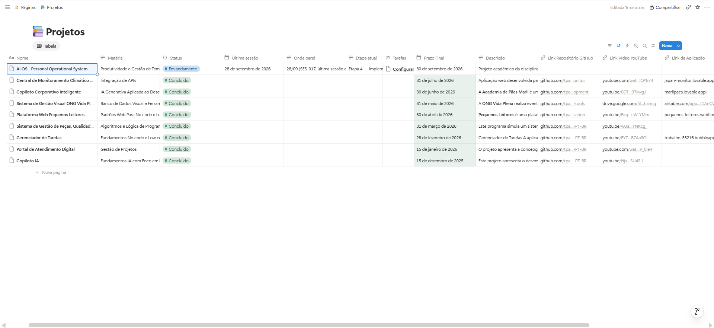
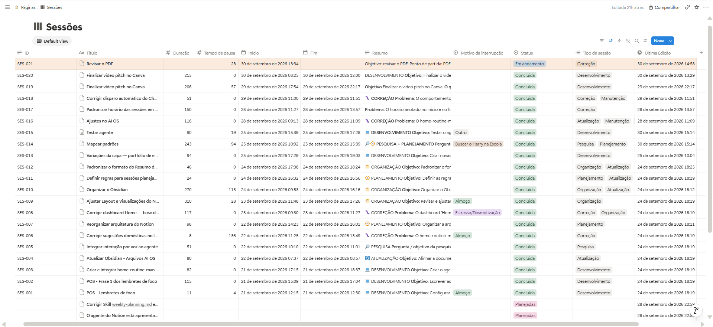
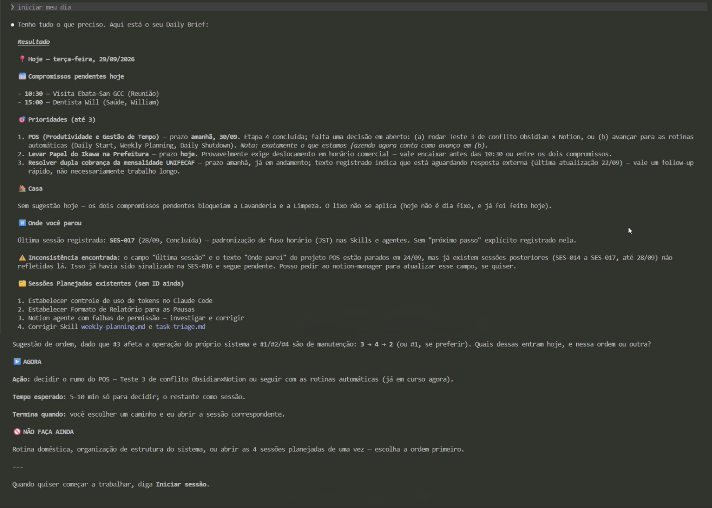
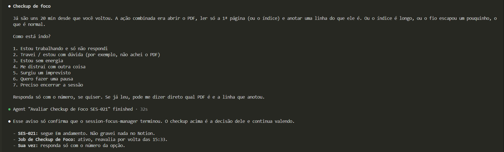
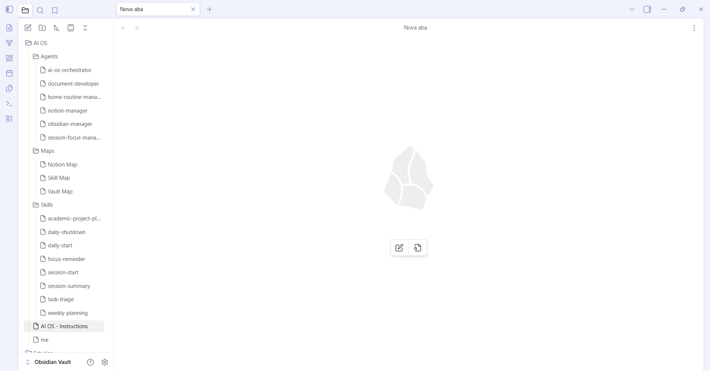

# 🧭 AIOS — Meu Sistema Operacional Pessoal (POS)

> Utilizando IA para gerenciar tempo, comunicação e produtividade.
> Projeto da disciplina **Produtividade e Gestão do Tempo** — UniFECAF.

**Autora:** Paloma Ai Tsuchinaga
**🎥 Link para Vídeo Pitch no Youtube:** [Assistir Aqui.](https://www.youtube.com/watch?v=tILvuEAZgv0)

---

## 📌 Descrição do sistema

O AI OS é um **POS**: um sistema pessoal em que a IA atua como uma gerente. Ela consulta o contexto, sugere prioridades, lembra onde parei e guarda o estado do trabalho. A decisão final continua sendo minha.

**Problema que ele resolve:** Me ajuda a controlar o tempo de foco, interrupções. Me ajuda a gerenciar, controlar e lembrar compromissos, tarefas e muito mais... Evitando distrações, me dando direções e registrando todas as decisões, mudanças e progresso que eu fiz.

**Ideia central:**

```
menos planejamento, mais ação
```

Regras que guiam o sistema:

- 🎯 Uma **próxima ação** concreta por vez.
- 🔝 No máximo **3 prioridades** por dia.
- 💡 A IA **sugere**, eu **decido**. Sugestão não vira compromisso.
- ⏸️ Pausar não é falhar: o ponto de retomada (**Onde parei**) fica sempre salvo.

**Técnicas de produtividade aplicadas:**

- **Matriz de Eisenhower** para priorizar tarefas da faculdade.
- **Sessões de foco** com objetivo claro, próxima ação e checkup de foco.

---

## 🛠️ Ferramentas utilizadas

| Ferramenta | Para que serve |
|---|---|
| **Notion** | Estado operacional: Tarefas, Projetos, Compromissos, Sessões, Rotina Doméstica e dashboards |
| **Obsidian** | Regras, documentação e conhecimento estável, em Markdown |
| **Claude Code (Agents)** | IA que lê e atualiza Notion e Obsidian seguindo as regras do sistema |
| **GitHub** | Documentação do projeto |

**Como a IA está organizada:**

```
Eu
 ↓
Claude Code
 ↓
ai-os-orchestrator  (coordena e delega)
 ├── notion-manager         → lê e escreve no Notion
 ├── obsidian-manager       → lê e escreve no Obsidian
 ├── session-focus-manager  → conduz as sessões de foco
 └── home-routine-manager   → sugere a rotina doméstica
```

**Divisão de papéis:**

```
Notion   → o que está acontecendo agora
Obsidian → como o sistema funciona
```

**Como a IA ajuda na prática:**

- Monta o resumo do dia (**Daily Brief**) com compromissos, tarefas e projetos.
- Sugere um foco e define a próxima ação.
- Registra sessões, pausas e duração.
- Guarda o **Onde parei** para eu retomar sem reconstruir o contexto.
- Lembra tarefas da casa sem interromper as sessões de foco.

---

## 🔄 Fluxo de organização



**Em uma frase:** entender → escolher → executar → parar sem perder contexto → retomar.

**Onde cada coisa fica no Notion:**

| Database | Guarda |
|---|---|
| Tarefas | O que preciso fazer, com prioridade (Eisenhower) e próxima ação |
| Projetos | Objetivo, etapa atual e **Onde parei** |
| Compromissos | Eventos e datas (Pendente / Concluído) |
| Sessões | Períodos reais de foco, com duração (Fim − Início − pausas) |
| Rotina Doméstica | Tarefas recorrentes da casa e a **última vez feito** |

**Dashboard:** a página **AI OS - Dashboard** no Notion reúne o acompanhamento das tarefas, dos projetos e das sessões.

---

## 🖼️ Prints

### AI OS - Dashboard


### Tarefas com Matriz de Eisenhower


### AI OS - Página de Projetos


### AI OS - Página Sessões


### Daily Brief ("Iniciar meu dia")


### Sessão de foco em ação


### Estrutura do AI OS no Obsidian


---

## 🚀 Como utilizar a solução

# **Como usar no dia a dia**

1. **Abra o Visual Studio Code:** Abra o projeto e execute no terminal `claude --agent ai-os-orchestrator`.
2. **Comece o dia:** diga **“Iniciar meu dia”** para ver compromissos e prioridades. Se houver sugestão de tarefa doméstica, aceite ou recuse; se fizer, avise quando terminar.
3. **Escolha o foco:** diga **“Iniciar sessão para…”** e informe o objetivo — ou **“Iniciar sessão”** para receber uma sugestão. Trabalhe na próxima ação e avise **“Feito”** ao concluir.
4. **Durante o trabalho:** diga **“Estou travada”** para pedir ajuda, **“Vou fazer uma pausa”** para pausar e **“Voltei”** para retomar.
5. **Ao parar:** use **“Encerrar sessão”** para fechar esse bloco de trabalho
6. **No Fim do Dia:**  envie **“Encerrar meu dia”** para salvar todo o progresso e fechar o dia. As sugestões domésticas finais são opcionais.
7. **Fechar o Terminal**

### O que acontece

| Quando | O que eu digo | O que acontece |
|---|---|---|
| Começar o dia | `Iniciar meu dia` | A IA monta o Daily Brief com no máximo 3 prioridades |
| Começar a trabalhar | `Iniciar sessão para <objetivo>` | Abre a sessão e define **uma** próxima ação |
| Terminar a ação | `Feito` | A IA avalia e indica o próximo passo |
| Preciso parar | `Pausa` | A sessão pausa e o ponto de retomada fica salvo |
| Encerrar o dia | `Encerrar meu dia` | A sessão fecha e o **Onde parei** é salvo |
| Ver a casa | `Checkup doméstico` | Mostra até 3 sugestões de tarefas domésticas |

> 💡 Se eu disser só `Iniciar sessão`, a IA sugere um foco e pergunta se eu quero seguir ou fazer outra coisa.

---

## ✅ Resultado

- Menos tempo decidindo o que fazer e mais tempo executando.
- Retomada rápida após pausas, graças ao **Onde parei**.
- Histórico real de sessões de foco.
- Rotina da casa lembrada sem atrapalhar o foco.
